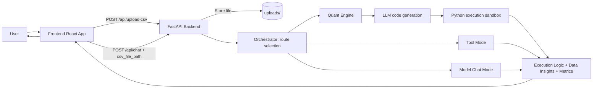

# Track B: Quantitative Forge

## Quantitative Forge Chat: Autonomous Data Swarm Studio

This repository is the Track B: Quantitative Forge project.

Quantitative Forge Chat is a full-stack autonomous analytics system built with React (frontend) and FastAPI (backend). It accepts natural-language analysis tasks, supports CSV upload, generates executable Python analysis logic, retries on errors, and returns structured insights.

## Functional Diagram (NotebookLM-Generated A2A Flow)

Diagram source note: this A2A functional diagram is documented as NotebookLM/NoteboomLM generated for Track B submission context.



## Agent Profiles (Role Descriptions)

1. Quant Orchestrator (core backend in `agents/main.py`)
- Decides request path: tool execution, quant analysis, or model chat.
- Validates CSV path and controls retry logic.

2. Quantitative Analysis Agent
- Converts user goals into executable Python using pandas and numpy.
- Cleans data, computes metrics, scans anomalies/trends, and emits structured results.

3. Tool Agent (local utility mode)
- Handles `tool:<name> {json}` style commands.
- Supports health check and utility operations via `tools/mcp_server.py`.

4. UI Presentation Agent (frontend state layer)
- Uploads CSV automatically after selection.
- Displays main chat output and side cards for `Data Insights` and `Computed Metrics`.

## Setup Instructions

### 1) Prerequisites

- Node.js 18+
- Python 3.10+
- Google Cloud project with Vertex AI enabled

### 2) Environment Setup

Copy the template and fill your key:

```bash
cp .env.example .env
```

Required variables:

- `VERTEX_AUTH_MODE` (`iam` recommended for production)
- `VERTEX_PROJECT_ID` (required for IAM mode)
- `VERTEX_LOCATION` (default: `us-central1`)
- `VERTEX_MODEL_NAME` (default: `gemini-2.5-flash`)
- `ALLOWED_ORIGINS` (default: `http://localhost:5173`)
- `VERTEX_SYSTEM_INSTRUCTION` (optional override)
- `VERTEX_API_KEY` (only if using `api_key` mode)
- `GSM_PROJECT_ID` (optional, defaults to `VERTEX_PROJECT_ID`)
- `GSM_VERTEX_API_KEY_SECRET` (optional, used in `api_key` mode)
- `GSM_SYSTEM_INSTRUCTION_SECRET` (optional)

### 2.1) Google Secret Manager Setup (Recommended)

Create secrets (example names):

```bash
gcloud secrets create vertex-api-key --replication-policy=automatic
printf '%s' 'YOUR_REAL_API_KEY' | gcloud secrets versions add vertex-api-key --data-file=-

gcloud secrets create vertex-system-instruction --replication-policy=automatic
printf '%s' 'You are the core agent of Quantitative Forge Chat...' | gcloud secrets versions add vertex-system-instruction --data-file=-
```

Grant runtime identity access:

```bash
gcloud secrets add-iam-policy-binding vertex-api-key \
  --member="serviceAccount:YOUR_RUNTIME_SA@YOUR_PROJECT_ID.iam.gserviceaccount.com" \
  --role="roles/secretmanager.secretAccessor"

gcloud secrets add-iam-policy-binding vertex-system-instruction \
  --member="serviceAccount:YOUR_RUNTIME_SA@YOUR_PROJECT_ID.iam.gserviceaccount.com" \
  --role="roles/secretmanager.secretAccessor"
```

Then set in `.env`:

```env
VERTEX_AUTH_MODE=iam
VERTEX_PROJECT_ID=your-gcp-project-id
VERTEX_LOCATION=us-central1
GSM_PROJECT_ID=your-gcp-project-id
GSM_SYSTEM_INSTRUCTION_SECRET=vertex-system-instruction

# Optional if you still use api_key mode
GSM_VERTEX_API_KEY_SECRET=vertex-api-key
```

### 3) Install Dependencies

Backend:

```bash
pip install -r requirements.txt
```

Frontend:

```bash
cd app
npm install
```

### 4) Run Services

Terminal A (backend):

```bash
uvicorn agents.main:app --reload --port 8000
```

Terminal B (frontend):

```bash
cd app
npm run dev
```

Open `http://localhost:5173`.

### 5) Optional: Run MCP Tool Server

```bash
python tools/mcp_server.py
```

### 6) Docker Deployment Guide

Use Docker Compose to run both frontend and backend with one command.

Prerequisites:

- Docker Engine 24+
- Docker Compose v2+

Step 1: Create environment file

```bash
cp .env.example .env
```

Step 2: Configure required variables in `.env`

- `VERTEX_AUTH_MODE=iam`
- `VERTEX_PROJECT_ID=<your-gcp-project-id>`
- `VERTEX_LOCATION=us-central1`
- `VERTEX_MODEL_NAME=gemini-2.5-flash`
- `ALLOWED_ORIGINS=http://localhost:5173`
- Optional: `GSM_PROJECT_ID`, `GSM_SYSTEM_INSTRUCTION_SECRET`, `GSM_VERTEX_API_KEY_SECRET`

Step 2.1: Provide Google credentials for IAM mode (local Docker)

Use one of these approaches:

1. Use a service-account JSON file mounted as ADC inside backend container.
2. Use a cloud runtime identity (Cloud Run/GKE/GCE) with no key file.

For local Docker with a key file, run backend with:

```bash
docker compose run --rm \
  -e GOOGLE_APPLICATION_CREDENTIALS=/var/secrets/google/key.json \
  -v /absolute/path/to/your-service-account.json:/var/secrets/google/key.json:ro \
  backend
```

Then start full stack normally:

```bash
docker compose up -d --build
```

Step 3: Build and start services

```bash
docker compose up -d --build
```

Step 4: Verify deployment

- Frontend: `http://localhost:5173`
- Backend API is internal-only in compose network (not exposed publicly).
- Backend health/tool test example:

```bash
curl -X POST http://localhost:5173/api/chat \
  -H "Content-Type: application/json" \
  -d '{"message":"tool:health_check"}'
```

Operational commands:

```bash
# Show running containers
docker compose ps

# Stream logs
docker compose logs -f

# Restart services
docker compose restart

# Rebuild after code changes
docker compose up -d --build

# Stop services
docker compose down

# Stop and remove uploaded CSV data volume
docker compose down -v
```

Notes:

- Uploaded files are stored in a named Docker volume (`uploads_data`).
- Frontend container serves static files via Nginx and proxies `/api` to backend.
- For production security, prefer IAM mode and avoid API keys.
- For secret management, prefer Google Secret Manager instead of plaintext `.env` values.

### 7) Cloud Run Deployment (Source Build)

If Cloud Build fails with:

`unable to evaluate symlinks in Dockerfile path: lstat /workspace/Dockerfile: no such file or directory`

check these items first:

1. Your latest commit must include `Dockerfile` at repository root.
2. Push your local changes before triggering deploy.
3. Trigger source repository and branch must point to the same updated commit.

Recommended verification before deploy:

```bash
git status
git add .
git commit -m "Prepare Cloud Run deploy"
git push origin main
```

Cloud Run build/deploy notes:

- This backend Dockerfile is configured to listen on `${PORT}` (Cloud Run requirement).
- For production, set runtime env vars in Cloud Run service config (do not rely on local `.env`).
- Prefer IAM + Secret Manager in Cloud Run, and avoid API key mode when possible.

## API Quick Reference

1. `POST /api/upload-csv`
- Content type: `multipart/form-data`
- Field: `file`
- Returns: `csv_file_path`

2. `POST /api/chat`
- JSON body example:

```json
{
  "message": "Analyze anomalies by category",
  "csv_file_path": "uploads/sample.csv"
}
```

## Project Structure

- `agents/` backend logic and prompts
- `app/` React + Vite UI
- `tools/` local MCP tools and scripts
- `uploads/` runtime CSV storage
- `requirements.txt` Python dependencies
- `.env.example` environment template

## Troubleshooting

1. `Missing VERTEX_PROJECT_ID in .env when VERTEX_AUTH_MODE=iam`
- Set `VERTEX_PROJECT_ID` and restart backend.

2. `Failed to load ... from Secret Manager`
- Check `GSM_PROJECT_ID` / secret names and IAM permissions (`roles/secretmanager.secretAccessor`).

3. Upload API fails
- Ensure dependencies are installed (`python-multipart` is required and included in `requirements.txt`).

4. Frontend cannot reach backend
- Ensure backend runs on port `8000` and Vite proxy is active.

## Security Notes

- Never commit `.env`.
- Keep API keys private.
- Uploaded CSV files are local runtime artifacts in `uploads/`.


