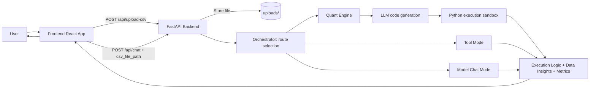

# Quantitative Forge Chat: Autonomous Data Swarm Studio

Quantitative Forge Chat is a full-stack autonomous analytics system built with React (frontend) and FastAPI (backend). It accepts natural-language analysis tasks, supports CSV upload, generates executable Python analysis logic, retries on errors, and returns structured insights.

## System Architecture Diagram (A2A Flow)



## Agent Profiles (Role Descriptions)

1. Quant Orchestrator (core backend in `agents/main.py`)
- Decides request path: tool execution, quant analysis, or model chat.
- Validates CSV path and controls retry logic.

2. Quantitative Analysis Agent
- Converts user goals into executable Python using pandas and numpy.
- Cleans data, computes metrics, scans anomalies/trends, and emits structured results.

3. Tool Agent (local utility mode)
- Handles `tool:<name> {json}` style commands.
- Supports health check and utility operations via `tools/mcp_server.py`.

4. UI Presentation Agent (frontend state layer)
- Uploads CSV automatically after selection.
- Displays main chat output and side cards for `Data Insights` and `Computed Metrics`.

## Setup Instructions

### 1) Prerequisites

- Node.js 18+
- Python 3.10+
- Gemini/Vertex API key

### 2) Environment Setup

Copy the template and fill your key:

```bash
cp .env.example .env
```

Required variables:

- `VERTEX_API_KEY`
- `VERTEX_MODEL_NAME` (default: `gemini-2.5-flash`)
- `ALLOWED_ORIGINS` (default: `http://localhost:5173`)
- `VERTEX_SYSTEM_INSTRUCTION` (optional override)

### 3) Install Dependencies

Backend:

```bash
pip install -r requirements.txt
```

Frontend:

```bash
cd app
npm install
```

### 4) Run Services

Terminal A (backend):

```bash
uvicorn agents.main:app --reload --port 8000
```

Terminal B (frontend):

```bash
cd app
npm run dev
```

Open `http://localhost:5173`.

### 5) Optional: Run MCP Tool Server

```bash
python tools/mcp_server.py
```

## API Quick Reference

1. `POST /api/upload-csv`
- Content type: `multipart/form-data`
- Field: `file`
- Returns: `csv_file_path`

2. `POST /api/chat`
- JSON body example:

```json
{
  "message": "Analyze anomalies by category",
  "csv_file_path": "uploads/sample.csv"
}
```

## Project Structure

- `agents/` backend logic and prompts
- `app/` React + Vite UI
- `tools/` local MCP tools and scripts
- `uploads/` runtime CSV storage
- `requirements.txt` Python dependencies
- `.env.example` environment template

## Troubleshooting

1. `Missing VERTEX_API_KEY in .env`
- Fill `.env` and restart backend.

2. Upload API fails
- Ensure dependencies are installed (`python-multipart` is required and included in `requirements.txt`).

3. Frontend cannot reach backend
- Ensure backend runs on port `8000` and Vite proxy is active.

## Security Notes

- Never commit `.env`.
- Keep API keys private.
- Uploaded CSV files are local runtime artifacts in `uploads/`.


